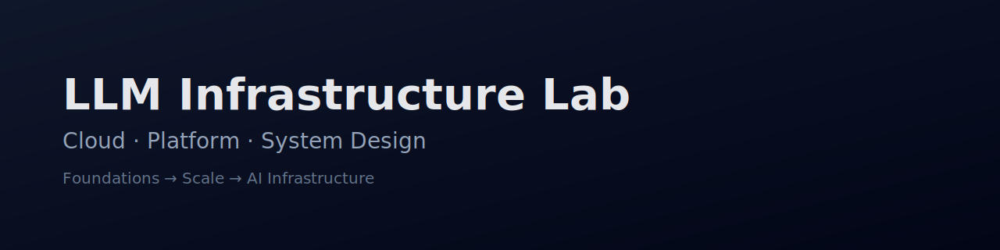

# 🧠 LLM Infrastructure Lab


---

## Hi there 👋  

This repository documents my **learning-by-doing journey** toward becoming a **Cloud / Platform Engineer**, with a long-term goal of working on **AI & LLM Infrastructure**.

This is **not a fixed roadmap**.

> It is an **evolutionary process** — goals, scope, and structure will change over time as my engineering foundations mature.

The intention of this repository is to **build real engineering intuition**, not to rush into tools or buzzwords.

---

## 🎯 Current Focus — Weeks 1–2

**Theme:**  
> _Foundations before tools_

At this stage, the focus is **not** on Kubernetes, MLOps, or large-scale AI systems yet.  
Instead, the goal is to strengthen the **fundamentals required to reason about them correctly later**.

### Objectives
- Build solid **engineering fundamentals**
- Learn to **think in systems**, not tools
- Reduce paralysis when facing open-ended technical problems
- Develop habits for **clear documentation and decision-making**

---

## 🧩 Scope for This Phase

### 1️⃣ Engineering Fundamentals
- Linux basics (processes, memory, logs)
- Networking fundamentals (HTTP, latency, DNS)
- Synchronous vs asynchronous execution
- Common bottlenecks in systems

📂 Location:
```
docs/system-design/
docs/notes/
```

---

### 2️⃣ System Design (Conceptual)
- What system design really is
- Functional vs non-functional requirements
- Latency, availability, scalability, and cost
- Thinking in trade-offs instead of “best practices”

📂 Location:
```
docs/system-design/
```

---

### 3️⃣ Learning Hygiene & Structure
- Separating **thinking** from **implementation**
- Writing short, focused design notes
- Making decisions explicit (even small ones)

📂 Location:
```
docs/
docs/decisions/
```

---

## 📁 Repository Structure (Early Stage)

```text
docs/
 ├─ system-design/      # Concepts, diagrams, mental models
 ├─ decisions/          # Architecture Decision Records (ADRs)
 └─ notes/              # Short learning notes

cloud/                  # (Empty for now – added later)
devops/                 # (Empty for now – added later)
mlops/                  # (Future phase)
```

> ⚠️ Empty folders are intentional.  
> Implementation comes **after** understanding.

---

## 📈 How This Repo Will Evolve

This repository will evolve over time:

- **Weeks 3–6** → Cloud fundamentals & basic DevOps
- **Later** → Platform patterns, automation, observability
- **Much later** → MLOps & AI Infrastructure concerns

Folders may grow, change, or be renamed.  
That evolution is **expected and documented**.

---

## 🧭 Philosophy

- **Depth over speed**
- **Understanding before tooling**
- **Systems over syntax**
- **Clarity over completeness**

This repository reflects how engineers actually grow:  
incrementally, with revisions, corrections, and better questions over time.

---

## 🚧 Status

- 🔄 Active learning phase  
- 🧪 Experimental  
- 📝 Documentation-first  

---

## 📌 Note to Future Me (and reviewers)

If something here looks basic, incomplete, or temporary —  
that is **by design**.

This repository captures **progress**, not perfection.
